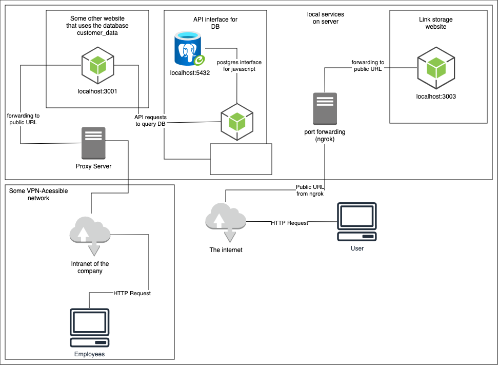

# Demonstrating localhost access through SSRF
This repository contains the source-code for my blog article about abusing
SSRF to gain access to hidden services in localhost.  
The architecture looks as follows:


## Running the server
First, clone the repository:
```
git clone git@github.com:aneshodza/ssrf-demo.git
cd ssrf-demo
```

After that, install the node modules:
```
npm install
cd internal-hidden-service; npm install; cd ..
cd public-face; npm install; cd ..
```

Next, you should pass the the `sql` file into your database:
```
mysql -u root -D customer_data < internal-hidden-service/database.sql
```
**Attention:** Maybe you have different mysql credentials. If so, please change the `mysql` command and change the credentials in `internal-hidden-service/server.js`

Now you can start the server:
```
npm start
```

If you are using `ngrok` to forward the port, use following command to create a public URL:
```
ngrok http 3003
```
You should see an output like this:
```
ngrok                                                                     (Ctrl+C to quit)

Try the new Traffic Inspector dev preview: https://ngrok.com/r/ti

Session Status                online
Account                       anes.hodza04@gmail.com (Plan: Free)
Update                        update available (version 3.7.0, Ctrl-U to update)
Version                       3.4.0
Region                        Europe (eu)
Latency                       -
Web Interface                 http://127.0.0.1:4041
Forwarding                    https://dd5c-195-176-29-163.ngrok-free.app -> http://localhost:3003

Connections                   ttl     opn     rt1     rt5     p50     p90
                              0       0       0.00    0.00    0.00    0.00
```

Navigate to the URL under `Forwarding`, where you should see your site.
